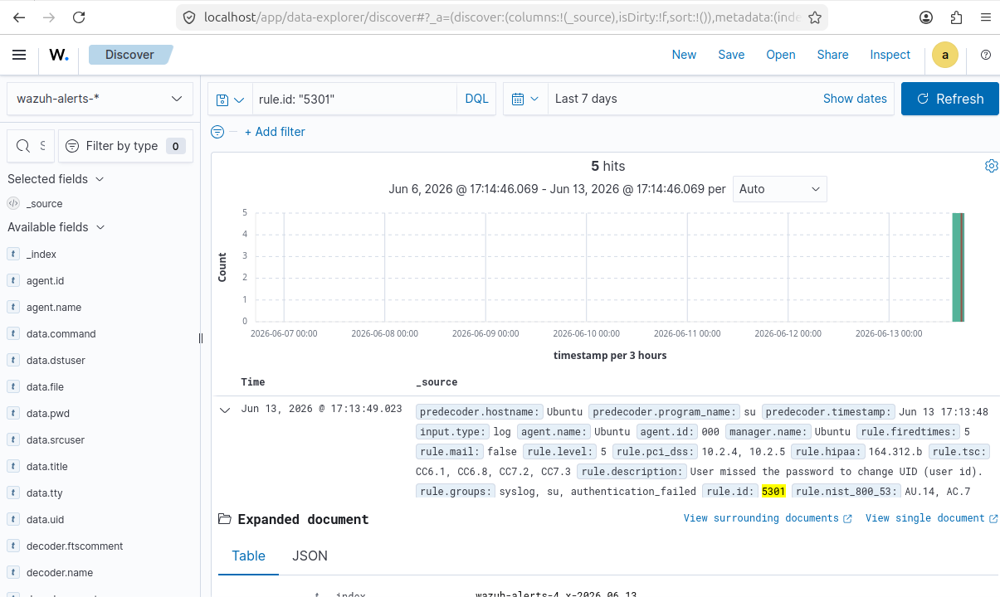
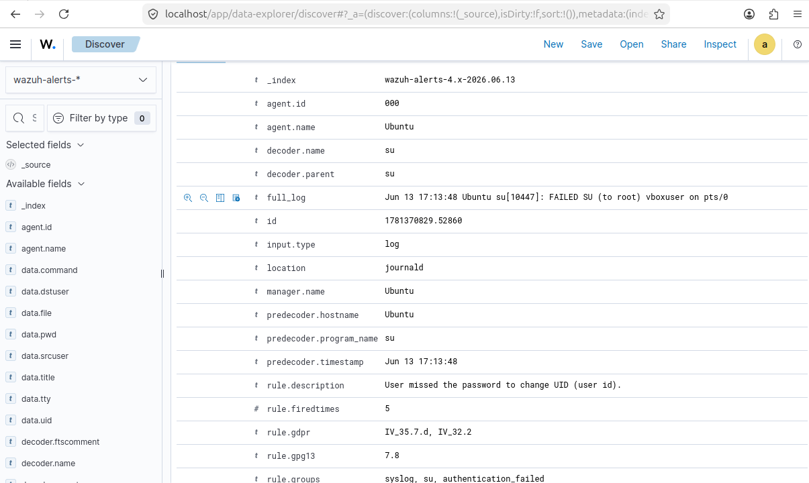
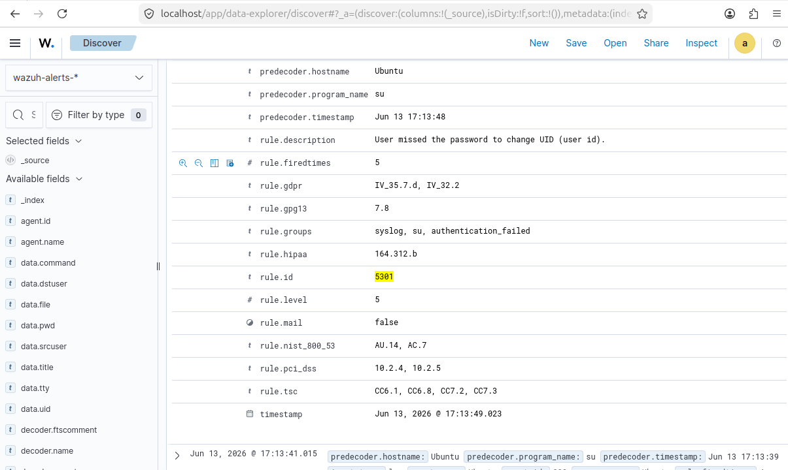

# Enterprise Threat Detection & SIEM Telemetry Portfolio
**Author:** Joshua Langley  
**Objective:** Practical design, configuration, and verification of automated defensive alert pipelines, centralized system log analysis, and localized authentication tracking.

---

## Lab 1: Privilege Escalation & Insider Threat Detection (Authentication Auditing)

### Executive Summary
This project targeted internal system telemetry by validating the Wazuh SIEM/XDR platform's capacity to intercept, parse, and alert on unauthorized credential probing and localized privilege escalation attempts. By monitoring core authentication logs in real-time, the deployment provides visibility when an active user attempts to compromise administrative security bounds.

### Tools & Environment
- **SIEM Engine:** Wazuh XDR Architecture (Single-Node Stack)
- **Target Host Node:** Ubuntu Linux VM (Agent 000)
- **Log Source:** Linux Core Authentication Infrastructure (`journald` / System Logs)
- **SIEM Rule Association:** Rule 5301 (su: Authentication failure)

### Technical Proof of Concept (Account Probing)
An insider threat scenario was simulated locally by targeting the administrative `root` profile with a sequence of rapid, unauthenticated password attempts from a local terminal session. This behavior mocks a manual brute-force or credential-guessing attack loop trying to gain elevated kernel access.

#### Telemetry Evidence: Alert Timeline

Upon execution of the failed switches, the Wazuh analysis engine successfully triggered an elevated Alert Level 5 security flag, registering a cluster of 5 distinct threat hits directly onto the analytical dashboard timeline.

#### Forensic Log Analysis

**Key Forensic Data Extracted (MITRE ATT&CK Technique T1078 - Valid Accounts):**
- **Log String Output:** `FAILED SU (to root) vboxuser on pts/0`
- **Targeted Account:** `root`
- **Source Session Profile:** `vboxuser`
- **Log Location:** `journald`

#### Rule Classification Mapping

The detailed metadata view validates that the ingestion engine successfully classified the raw text string against **Rule ID 5301**. This maps directly to industry compliance frames, checking off auditing baselines for access control monitoring.

### Defensive Alignment & Takeaways
This lab demonstrates practical capability in utilizing a centralized SIEM to maintain structural visibility over local systems. In a production Security Operations Center (SOC), this pipeline ensures immediate, actionable routing the second an insider threat or compromised asset attempts to move laterally, abuse local profiles, or upgrade privileges on an enterprise endpoint.
